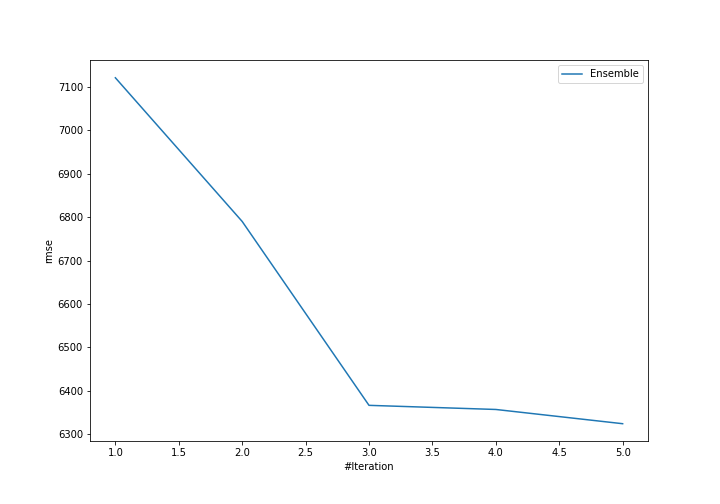
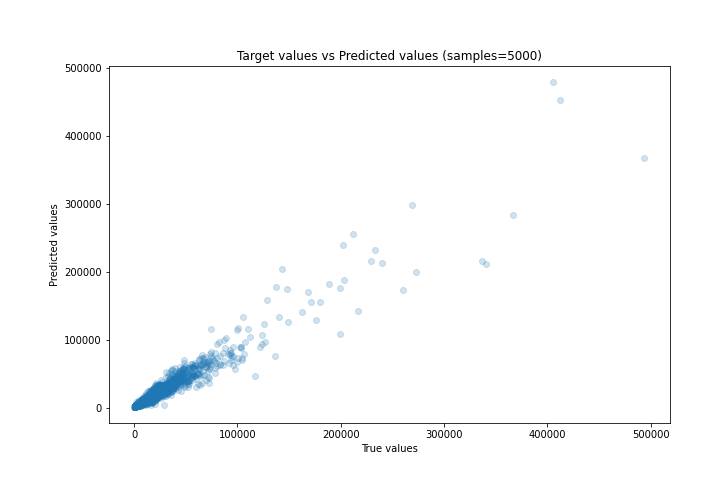
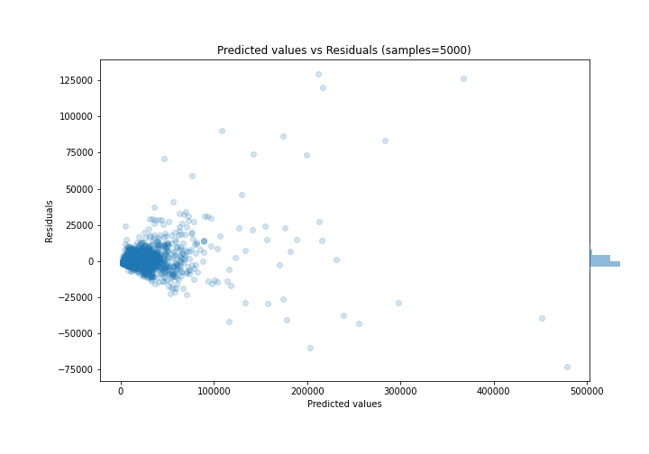

# Summary of Ensemble

[<< Go back](../README.md)

## Ensemble structure
| Model                   |   Weight |
|:------------------------|---------:|
| 2_DecisionTree          |        1 |
| 3_Default_Xgboost       |        3 |
| 4_Default_NeuralNetwork |        1 |

### Metric details:
| Metric   |          Score |
|:---------|---------------:|
| MAE      | 2437.8         |
| MSE      |    3.99923e+07 |
| RMSE     | 6323.94        |
| R2       |    0.927814    |
| MAPE     |    0.68181     |

## Learning curves

## True vs Predicted

## Predicted vs Residuals

[<< Go back](../README.md)
